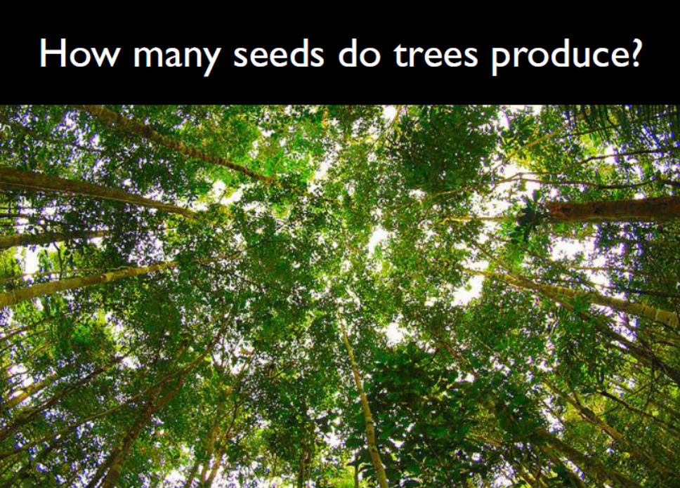
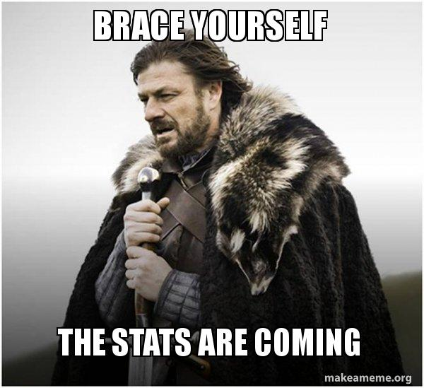

```{r setup, include=FALSE}
knitr::opts_chunk$set(echo = FALSE, warnings = FALSE, message = FALSE)
```

## ¿Para qué sirve la estadística?

Para responder preguntas como:

>- ¿Cuál es la probabilidad de que ocurra un evento?
>- ¿X influencia a Y? ¿en qué magnitud?
>- ¿Podemos predecir X conociendo Y? ¿Cómo de buenas son nuestras predicciones?

## ¿Para qué sirve la estadística?



## ¿Qué veremos en esta asignatura?

>- Estadística descriptiva
>- Representaciones gráficas de datos
>- Diseño experimental
>- Modelos estadísticos
>- Estadística multivariante (Nacho Bartomeus)
>- Análisis reproducibles
>- Todo ello, usando R

## Organización

* 18/01: Introducción a R
* 19-21/01: Estadística
* 22/01: Análisis reproducibles

## Recursos

Web con los materiales del curso: https://github.com/garciacallejas/UHU_estadistica_2021

* Libros de apoyo (NO usar libgen.is para descargar libros gratis...):
    + https://www.discoveringstatistics.com/books/discovering-statistics-using-r/
    + https://whitlockschluter3e.zoology.ubc.ca/index.html
    + https://www.wiley.com/en-es/Choosing+and+Using+Statistics:+A+Biologist's+Guide,+3rd+Edition-p-9781405198394

* tutoriales/cursos online:
    + Coursera: https://www.coursera.org/specializations/statistics

## Más info

* Evaluación: Trabajo práctico (**Fecha de entrega: 15/02**)
* david.garcia.callejas@gmail.com
* ¿dudas?

## ¡Empezamos!

